# Tenable Vulnerability Assessment
## Authenticated vs. Unauthenticated Scan

## Objective

The objective of this lab is to perform both **Unauthenticated** and **Authenticated** vulnerability scans against a Windows Virtual Machine using **Tenable Vulnerability Management**, compare the results, and understand the benefits of authenticated scanning.

---

# Lab Environment

| Component | Details |
|----------|---------|
| Scanner | Tenable Vulnerability Management |
| Target | Windows Virtual Machine |
| Scanner Type | Internal Scanner |
| Scan Type | Basic Network Scan |
| Target IP | `10.0.0.109` |

---

# Prerequisites

Before starting the scan, ensure:

- Windows Virtual Machine is running.
- Tenable Scanner is online.
- Administrative access to the VM is available.
- Network connectivity exists between the scanner and the target VM.

---

# Part 1: Configure the Target Machine

## Step 1: Disable Windows Defender Firewall

Disable all Windows Defender Firewall profiles on the target VM.

> **Figure 1:** Windows Defender Firewall Disabled

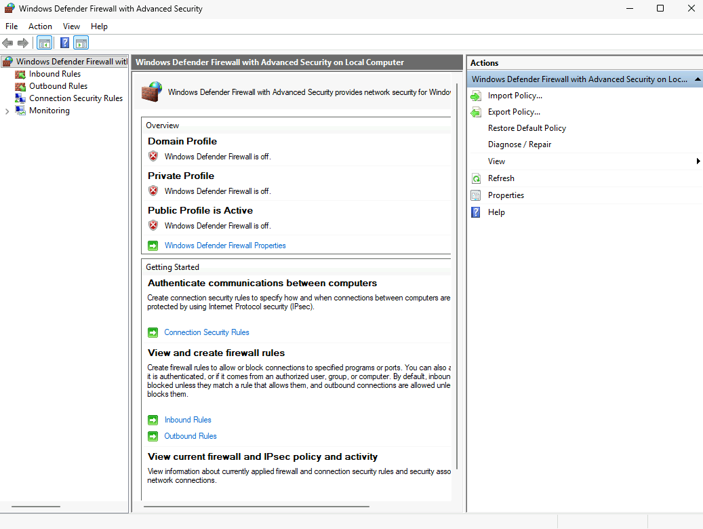

---

## Step 2: Configure the Network Security Group (NSG)

Associate the VM with the required Network Security Group.

**Navigation**

```

Azure Portal
→ Network Security Groups
→ Ali-NSG
→ Network Interfaces
→ vm-1667
→ Settings
→ Network Security Group

```

Select **Ali-NSG**.

> **Figure 2:** NSG Associated with the Virtual Machine

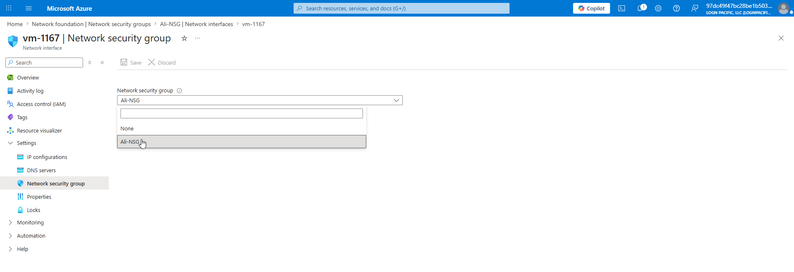

---

## Step 3: Create an Inbound Rule for the Scan Engine

Create an inbound security rule to allow traffic from the Tenable Scan Engine.

Example configuration:

| Setting | Value |
|---------|-------|
| Source | 10.0.0.8 (Scanner) |
| Destination | Virtual Machine |
| Protocol | Any |
| Action | Allow |

> **Figure 3:** NSG Rule for the Scan Engine

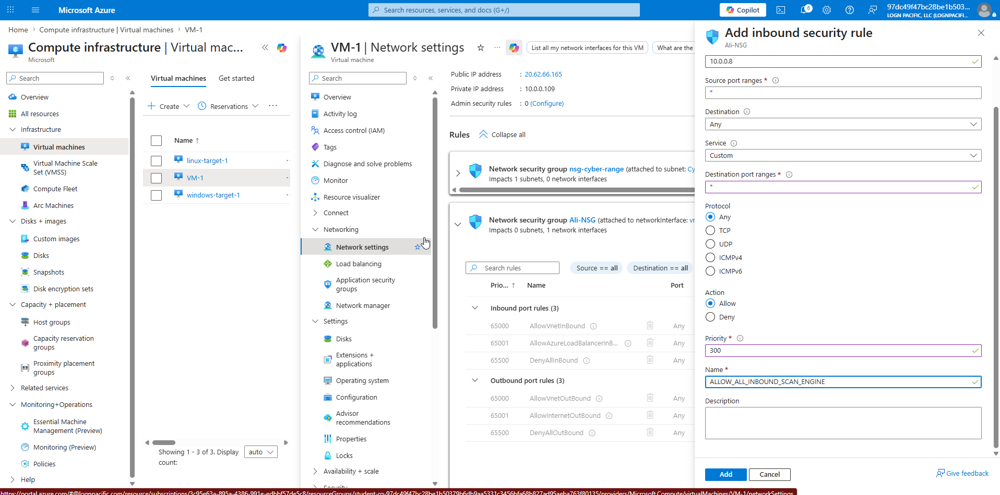

---

## Step 4: Create an Allow-All Rule (Lab Only)

Create an additional inbound rule allowing all traffic.

> **Note:** This rule should only be used in a lab environment and **never** in production.

> **Figure 4:** Allow-All NSG Rule

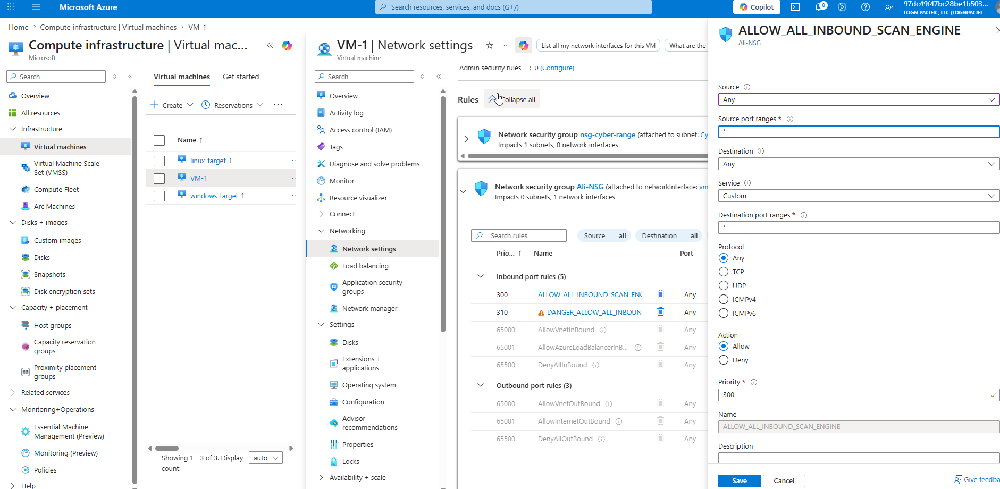

---

# Part 2: Perform an Unauthenticated Scan

## Step 5: Create a Basic Network Scan

In the Tenable portal:

```

Scans
→ Create Scan
→ Basic Network Scan

```

Configure the scan using the following settings:

| Setting | Value |
|---------|-------|
| Name | Unauthenticated Scan |
| Scanner | Internal Scanner |
| Scan Engine | Local Scan Engine |
| Target | 10.0.0.109 |

> **Figure 5:** Basic Network Scan Configuration

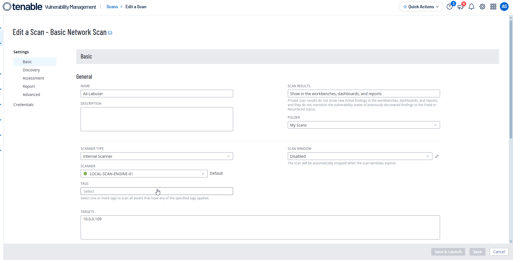

---

## Step 6: Configure Discovery Settings

Navigate to:

```

Discovery

```

Configure the following:

- **Scan Type:** Custom
- Enable **Ping the Remote Host**

Save the configuration.

> **Figure 6:** Discovery Settings

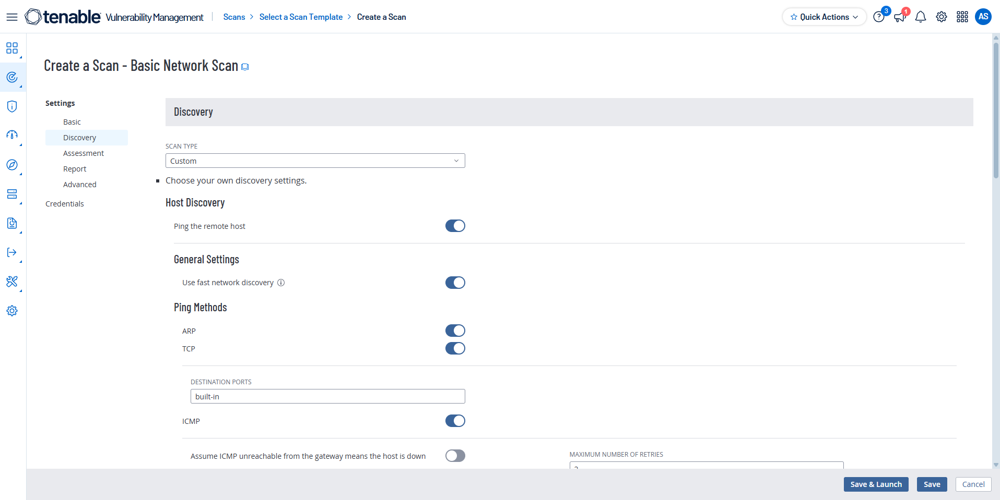

---

## Step 7: Launch the Scan

Click **Save**, then **Launch**.

Wait for the scan to complete.

### Scan Duration

- **Unauthenticated Scan:** Approximately **9 minutes**

After completion:

- Export the scan report.
- Review detected vulnerabilities.
- Observe CVSS scores and severity ratings.

> **Figure 7:** Unauthenticated Scan Results

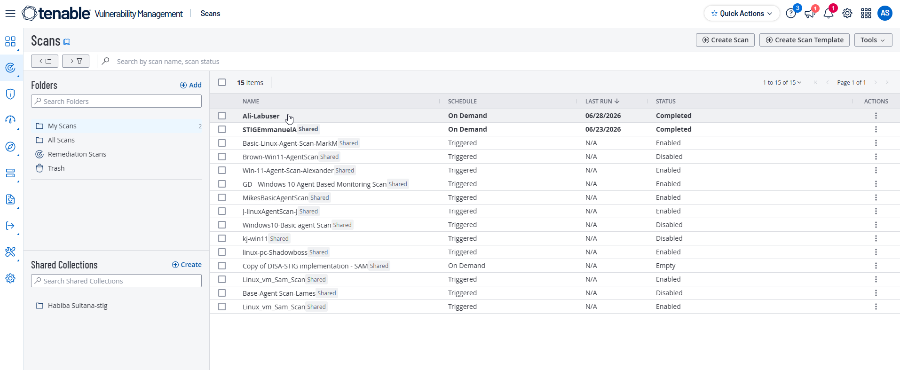

---

# Part 3: Perform an Authenticated Scan

Authenticated scanning allows Tenable to log into the operating system and perform a much deeper security assessment.

---

## Step 8: Configure Windows Credentials

Edit the existing scan.

Navigate to:

```

Credentials
→ Add Credentials
→ Host
→ Windows

````

Enter:

- Windows Username
- Windows Password

Enable all **Scan-Wide Credential Settings**.

> **Figure 8:** Windows Credentials Configuration

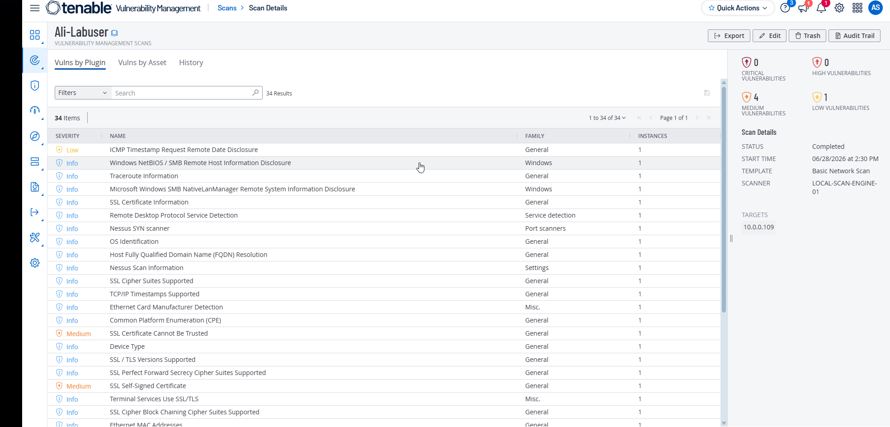

---

## Step 9: Enable Remote Administrative Access

Run the following PowerShell command **as Administrator** on the target VM.

```powershell
Set-ItemProperty 
-Path "HKLM:\SOFTWARE\Microsoft\Windows\CurrentVersion\Policies\System" 
-Name "LocalAccountTokenFilterPolicy" 
-Value 1 
-Type DWord 
-Force
````

This registry modification allows local administrator accounts to authenticate remotely with full administrative privileges during authenticated scans.

> **Figure 9:** PowerShell Command Execution

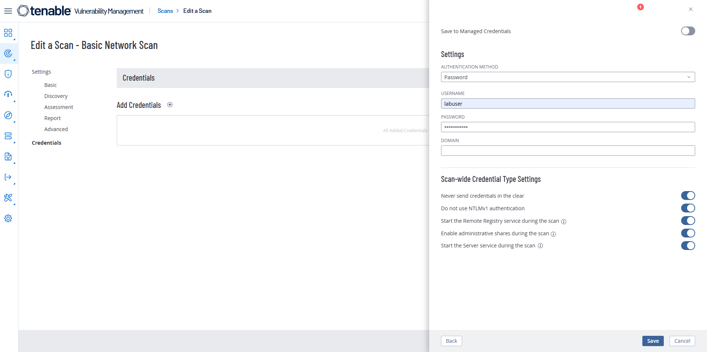

---

## Step 10: Launch the Authenticated Scan

Run the scan again.

### Scan Duration

* **Authenticated Scan:** Approximately **20 minutes**

After completion:

* Export the report.
* Review additional findings.
* Compare the results with the unauthenticated scan.

> **Figure 10:** Authenticated Scan Results

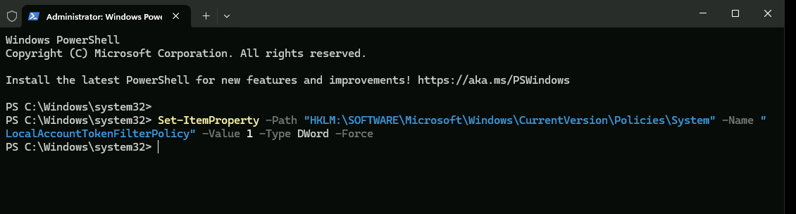

---

# Part 4: Compare Scan Results

| Feature                      | Unauthenticated Scan | Authenticated Scan |
| ---------------------------- | -------------------- | ------------------ |
| Login to Target              | ❌ No                 | ✅ Yes              |
| Scan Duration                | 9 Minutes            | 20 Minutes         |
| Missing Patch Detection      | Limited              | Comprehensive      |
| Registry Inspection          | ❌                    | ✅                  |
| Installed Software Detection | ❌                    | ✅                  |
| Local Configuration Audit    | ❌                    | ✅                  |
| Vulnerability Coverage       | Limited              | Extensive          |

> **Figure 11:** Comparison of Scan Results

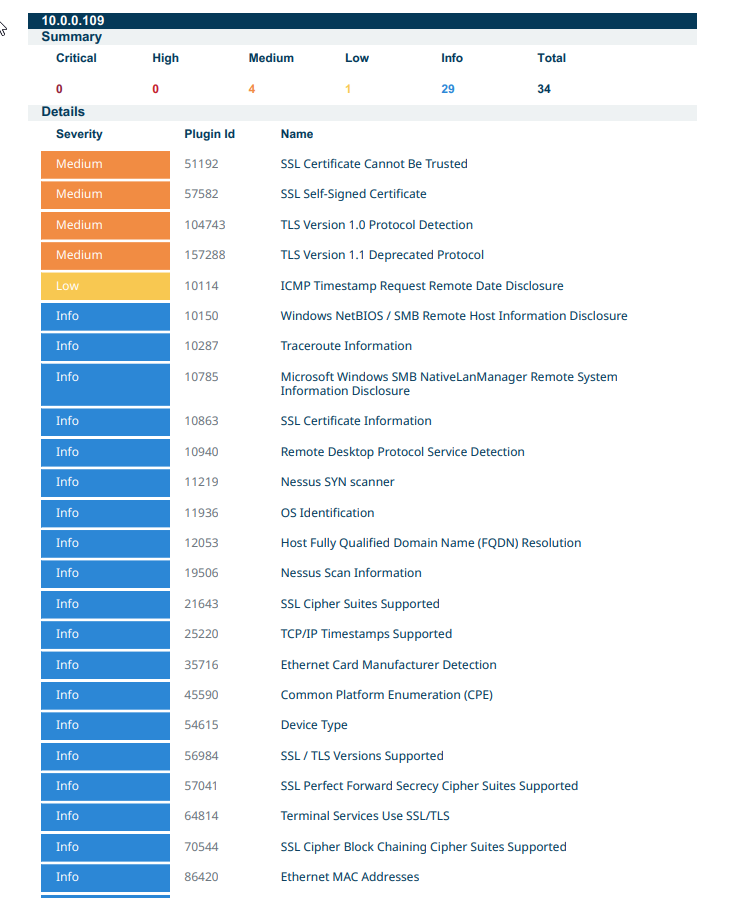

---

# Observations

## Unauthenticated Scan

* Simulates an external attacker.
* Identifies publicly accessible vulnerabilities.
* Cannot inspect internal system configurations.
* Completes faster than authenticated scanning.

---

## Authenticated Scan

* Uses valid Windows credentials.
* Performs an in-depth inspection of the operating system.
* Detects missing security patches.
* Identifies registry and configuration issues.
* Provides more comprehensive and accurate vulnerability results.

---

# Conclusion

The authenticated scan provided significantly greater visibility into the security posture of the Windows virtual machine. While the unauthenticated scan successfully identified externally visible vulnerabilities, the authenticated scan detected additional security weaknesses, including missing patches and configuration issues that were inaccessible without administrative credentials.

Authenticated scanning is recommended for enterprise vulnerability management because it delivers more comprehensive results, reduces false positives, and provides more actionable remediation guidance.

```
```
